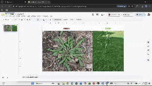
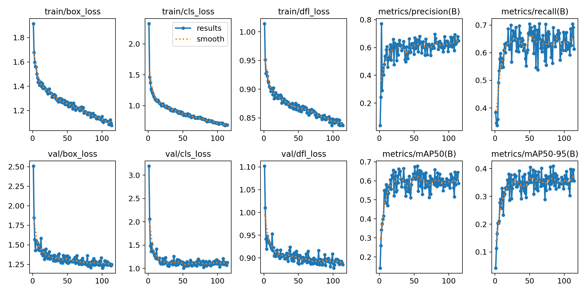
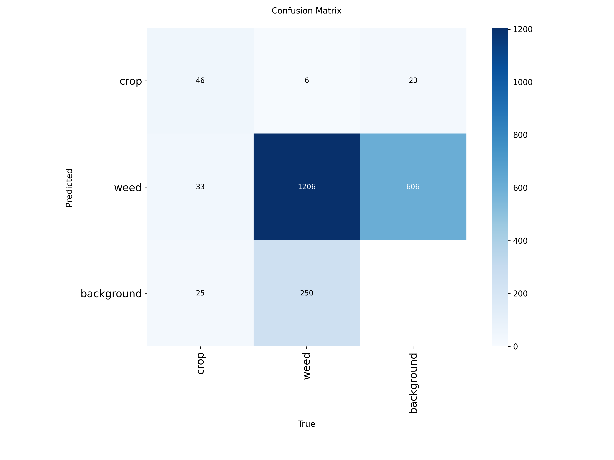

# AgroVision — Real-Time Weed Detection with YOLOv8

A fine-tuned YOLOv8 model that detects weeds vs. crops in corn fields in real time, built to power targeted automated pesticide spraying instead of blanket application. Developed through the STEM Institute (SI) summer research program, using the Cardinal supercomputer at the Ohio Supercomputer Center, The Ohio State University.

## Project Demo
<p align="center">
  
</p>


## Why This Matters

Blanket pesticide spraying wastes chemicals and pollutes runoff. Automated, targeted spraying — only hitting the weeds, not the crops — can cut pesticide use by an estimated 70% in real deployments. Building the detection layer that makes targeted spraying possible is what this project does.

A standard, pretrained YOLO model was tested on real field images first — it frequently missed or misclassified weeds. Off-the-shelf object detection isn't built for this task; it needs fine-tuning on a dedicated weed-vs-crop dataset, which is what this project delivers.

## Data Pipeline

Good data was the hardest part of this project — harder than the model itself. It took three full dataset iterations before landing on one that actually worked.

1. **Field collection:** GoPro cameras mounted and calibrated on an ATV, capturing corn rows and weeds from a realistic sprayer's-eye viewpoint while driving through the field.
2. **Preprocessing:** Raw footage had noise, blur, and inconsistent brightness/saturation — frames were extracted, cropped, and corrected before annotation.
3. **Augmentation:** Randomized brightness, saturation, scale, and orientation to prevent overfitting and reduce the effects of class imbalance (far more weed examples than crop examples in raw footage).
4. **Iteration:**
   - **V1 (unannotated):** No bounding boxes or labels — no ground truth to learn from, weeds were consistently misinterpreted.
   - **V2 (Kaggle-annotated):** Better, but not representative enough of real field conditions.
   - **V3 (flagship):** Combined and rebalanced custom + external annotated data — the dataset that actually worked.

## Training

Trained on the **Cardinal supercomputer** (Ohio Supercomputer Center):

- **Compute:** 1× NVIDIA H100, 96 GB HBM
- **CPU:** Intel Xeon CPU Max 9470 (2.0 GHz), 2 sockets, 1 node

Three training rounds were run on the flagship (V3) dataset, evaluating after each round with a consistent metric set (confusion matrix, accuracy, precision, recall, F1) and adjusting data or hyperparameters between rounds. Box loss (bounding box accuracy) and class loss (label confidence/correctness) both trended down consistently across the three rounds — the clearest signal the rebalanced dataset had actually fixed the problems from V1/V2.

## Results

| Metric | Score |
|---|---|
| Precision | 0.636 |
| Recall | 0.691 |
| F1 | 0.662 |
| mAP@0.5 | 0.642 |
| mAP@0.5:0.95 | 0.409 |

*(Best-performing checkpoint, selected by validation fitness during training — see [`results/metrics/results.csv`](results/metrics/results.csv) for the full per-epoch training log.)*

**Precision** matters because false positives waste spray on crops; **recall** matters because missed weeds don't get sprayed at all — both were tracked every epoch to catch tradeoffs between them.

See [`results/metrics/`](results/metrics/) for full precision/recall/F1 curves, box/class loss curves, and confusion matrices (raw counts and normalized).




## Web App

The final deliverable: upload an image or video of a field and get back real-time detections — bounding boxes, class labels, and confidence scores, the same output format an automated sprayer would use.

- **Backend:** Flask, YOLOv8 inference with SAHI (Slicing Aided Hyper Inference) for better detection of small objects in high-resolution field images
- **Frontend:** HTML/CSS/JS

### Running It Locally

**Requirements:** Python 3.9+, a trained YOLOv8 `.pt` model file

```bash
pip install -r requirements.txt
```

Update `MODEL_PATH` and `CLASS_NAMES` in `app.py`:

```python
MODEL_PATH = "best.pt"
CLASS_NAMES = {0: "crop", 1: "weed"}
```

Start the backend, then open `index.html` in your browser:

```bash
python app.py
```

The sidebar status indicator turns green once connected to the backend.

**Optional:** disable SAHI for faster/less-precise inference (`USE_SAHI = False` in `app.py`), or enable GPU (`device="cuda:0"`).

## Dataset & Attribution

Training data combined three sources across dataset iterations:

- **V2 dataset:** [CropWeeds-YOLO Dataset](https://www.kaggle.com/datasets/swish9/weeds-detection) (Kaggle, swish9) — pre-annotated crop/weed images used for the second dataset iteration.
- **V3 (flagship) dataset:** custom field data collected firsthand (GoPro/ATV corn field footage), combined and rebalanced with external annotated data, including the **Dataset of Annotated Food Crops and Weed Images**:

```
Sudars, K., Jasko, J., Namatevs, I., Ozola, L., & Badaukis, N. (2020).
Dataset of annotated food crops and weed images for robotic computer vision control.
Data in Brief, 31, 105833. https://doi.org/10.1016/j.dib.2020.105833
```

## Note on Model Weights

Trained weights (`best.pt`) are not published in this public repo. Reach out if you'd like to discuss the model directly.

## Acknowledgments

Developed through the STEM Institute (SI) summer research program with access to the Cardinal supercomputer at the Ohio Supercomputer Center, The Ohio State University. Field data collection was a team effort.

## Author

Harjas Sidhu — [github.com/sidhuharjas](https://github.com/sidhuharjas) · [sidhuharjas.github.io](https://sidhuharjas.github.io)
